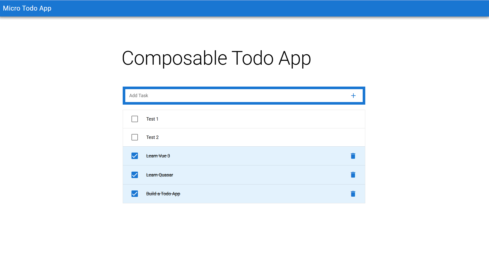

# Quasar Micro Frontend Architecture (with Vite + Module Federation)

This project is a modular **Micro Frontend (MFE)** architecture built using [Quasar Framework](https://quasar.dev/), [Vite](https://vitejs.dev/), and [vite-plugin-federation](https://github.com/originjs/vite-plugin-federation). It demonstrates a scalable approach to building modern front-end applications using **independent remote apps** and a **central gateway (host)**.

---

## 🧹 Micro Frontend Structure

```
apps/
├── gateway-manager   # Host app (Shell/Container)
├── todo-form         # Remote app (MFE 1)
├── todo-list         # Remote app (MFE 2)
shared/
└── composables/      # Shared code (e.g., useTodo composable)
```

- Each app is a standalone Vite + Quasar app.
- Remotes expose components or logic.
- Host dynamically loads and renders remote modules at runtime.

---

## 📷 Screenshot



---

## ✨ Features

- 🧱 Built with [Quasar Framework](https://quasar.dev/)
- ⚡ Fast dev server with [Vite](https://vitejs.dev/)
- 🧪 Isolated development for each remote
- 📆 Shared state & logic via composables
- 🔌 Powered by [vite-plugin-federation](https://github.com/originjs/vite-plugin-federation)

---

## 📦 Install Dependencies

```bash
pnpm install
```

> Ensure [pnpm](https://pnpm.io/) is installed globally.

---

## 💠 Development

### 1. Run Remote Apps (e.g., `todo-form`, `todo-list`)

```bash
pnpm run:remotes
```

This starts all remote apps on their respective ports (configured in `vite.config.ts`).

### 2. Run the Gateway (Host) App

```bash
pnpm run:host
```

The `gateway-manager` app acts as the shell and dynamically loads components from the remotes via module federation.

---

## 🔗 Micro Frontend Flow

- `gateway-manager` (host) loads remote modules at runtime.
- Shared logic like `useTodo` comes from the `shared/composables` folder.
- All apps share dependencies like `vue`, `pinia`, and `quasar` via `vite-plugin-federation`.

---

## 🧐 Concepts Used

- **Module Federation** – For runtime sharing of components between independent apps.
- **Shared Composables** – To share logic like state, dialogs, etc.
- **Alias Mapping** – Used to resolve shared modules in federation builds.

---

## 📁 Folder Highlights

| Folder               | Purpose                             |
|----------------------|-------------------------------------|
| `apps/gateway-manager` | Main shell application (host)      |
| `apps/todo-form`       | Remote micro frontend (form UI)    |
| `apps/todo-list`       | Remote micro frontend (list UI)    |
| `shared/`              | Shared composables, utils, stores  |

---

## 📌 Requirements

- Node.js `>=18`
- [pnpm](https://pnpm.io/) `>=8`
- Compatible terminal to run concurrent processes

---

## 🤝 Contributions

PRs, issues, and suggestions are welcome!

---

## 📜 License

MIT

